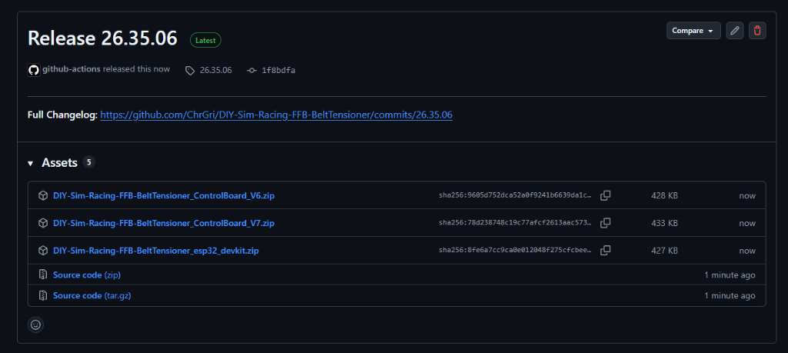
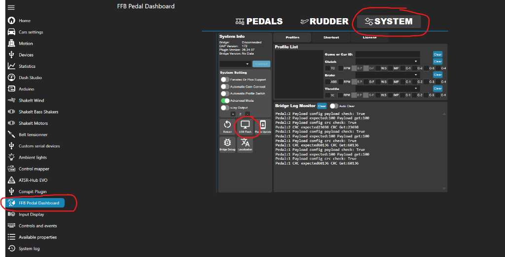
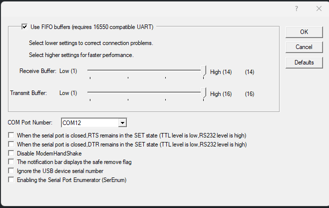
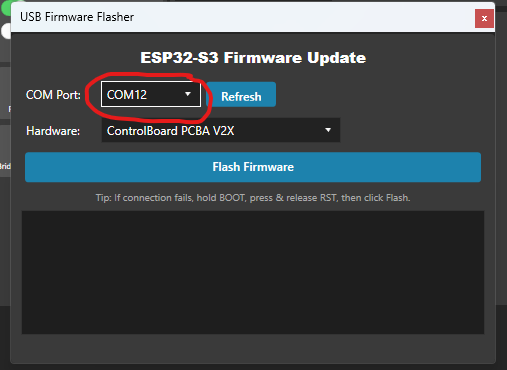
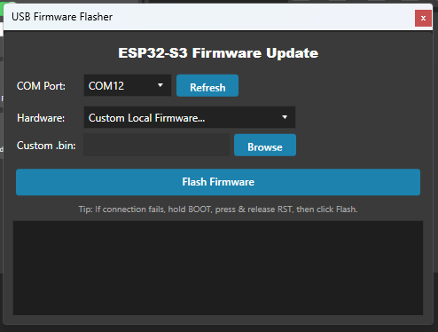

# Firmware Flashing Guide

This guide explains how to flash the pre-compiled firmware to your **ControlBoard_V6**, **ControlBoard_V7**, or **ESP32 DevKit** controller using the built-in USB Flasher in the **FFB Pedal Dashboard (SimHub Plugin)**.

---

## 🚀 Step-by-Step Flashing Instructions

### Step 1: Download the Release Archive
1. Go to the [Releases](https://github.com/ChrGri/DIY-Sim-Racing-FFB-BeltTensioner/releases) page.
2. Under **Assets**, download the `.zip` archive matching your hardware board:
   * `DIY-Sim-Racing-FFB-BeltTensioner_ControlBoard_V6.zip` (ESP32-S3 DevKit)
   * `DIY-Sim-Racing-FFB-BeltTensioner_ControlBoard_V7.zip` (ESP32-S3 Zero)
   * `DIY-Sim-Racing-FFB-BeltTensioner_esp32_devkit.zip` (ESP32 DevKit v1)

  

---

### Step 2: Unzip the Archive
Extract the downloaded `.zip` file into a local folder on your computer.

> [!IMPORTANT]
> Keep all extracted files (`firmware.bin`, `bootloader.bin`, `partitions.bin`, `boot_app0.bin`) together in the same folder. The flasher requires these companion binary files to be adjacent to `firmware.bin`.

---

### Step 3: Open USB Flash in SimHub FFB Pedal Dashboard
1. Open **SimHub** and select **FFB Pedal Dashboard** in the left menu.
2. Click on the **SYSTEM** tab at the top right.
3. Click on the **USB Flash** button.

  

---

### Step 4: Verify COM Port Settings & Select Port

1. Connect your controller board to your PC via USB.
2. Open **Windows Device Manager** (*Geräte-Manager*):
   * Expand **Ports (COM & LPT)** (*Anschlüsse (COM & LPT)*).
   * Right-click your ESP32 COM port (e.g. `COM12` / `CH343` / `CP210x`) and click **Properties** (*Eigenschaften*).
   * Switch to the **Port Settings** (*Anschlusseinstellungen*) tab and click **Advanced...** (*Erweitert...*).
   * Verify that your advanced port settings match the configuration shown below:
     * **Use FIFO buffers:** Enabled / Checked
     * **Receive Buffer:** High (14)
     * **Transmit Buffer:** High (16)
     * Additional flags (RTS/DTR set states, ModemHandshake, etc.): Disabled / Unchecked

  

3. In the SimHub **USB Firmware Flasher** window, select your controller's **COM Port** from the dropdown menu (e.g. `COM12`).
4. If your port does not appear, click **Refresh**.

  

---

### Step 5: Choose Custom Firmware & Select `firmware.bin`
1. Under the **Hardware** dropdown, select **Custom Local Firmware...**
2. Click the **Browse** button next to **Custom .bin**.
3. Navigate to the extracted folder from Step 2 and select **`firmware.bin`**.

  

---

### Step 6: Flash the Firmware
1. Click the **Flash Firmware** button.
2. Wait for the flashing process to complete.
3. **Done!** The status LED will cycle to indicate startup and the controller is ready for use in SimHub.

> [!TIP]
> **Troubleshooting / Bootloader Mode:**  
> If the flasher fails to connect or times out, put the ESP32 into ROM bootloader mode:
> 1. Hold down the **BOOT** button on the board.
> 2. Press and release the **RST** (Reset) button.
> 3. Release the **BOOT** button.
> 4. Click **Flash Firmware** again.
