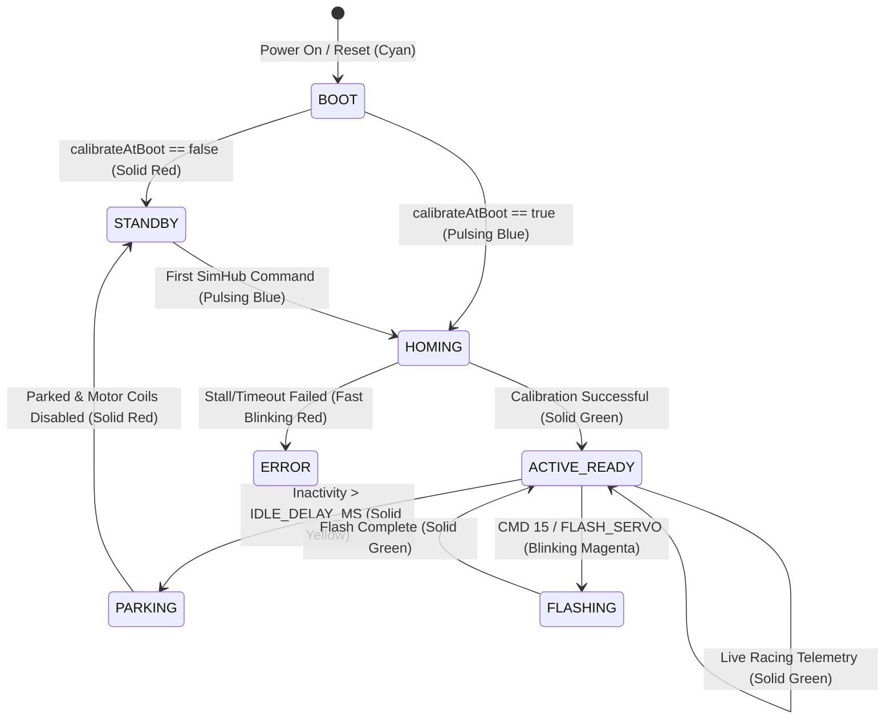

# RGB Status LED Guide

The DIY FFB Belt Tensioner firmware includes integrated support for the on-board addressable **WS2812 RGB LED** (NeoPixel) found on ESP32-S3 development boards (such as the Waveshare ESP32-S3-DevKitC-1 and ESP32-S3-Zero).

The LED provides instant visual feedback on the system's operational status, homing routine, standby state, and error conditions.

---

## 1. Status & Color Reference

| LED Color | Pattern | System State | Description |
| :--- | :--- | :--- | :--- |
| 🔴 **Solid Red** | Continuous | **Standby / Motor Disabled** | Motors are unpowered, cool, and silent. Waiting for the first SimHub motion command. |
| 🔵 **Pulsing Blue / Cyan** | 300 ms Blink | **Homing / Calibration** | Sensorless homing routine is actively finding the physical mechanical hard stop. Normal motion commands are safely blocked. |
| 🟢 **Solid Green** | Continuous | **Active & Ready** | Axis is powered, calibrated, and actively responding to real-time SimHub telemetry. |
| 🟡 **Solid Yellow** | Continuous | **Idle Parking** | Tensioner has detected inactivity (`IDLE_DELAY_MS`) and is traveling to the relaxed 10% park position before cutting motor power. |
| 🚨 **Fast Blinking Red** | 200 ms Fast Blink | **Error / Fault** | Homing failed or servo Modbus communication timed out. Motion is locked out for safety. |
| 🟣 **Blinking Magenta** | 150 ms Blink | **EEPROM Flashing** | Tuned parameters are being written into the iSV57 non-volatile EEPROM memory (`FLASH_SERVO`). |
| 🌐 **Solid Cyan** | Continuous | **Boot / Connecting** | ESP32 is initializing peripherals and discovering the iSV57 servo over Modbus RTU. |

---

## 2. State Progression Workflow



---

## 3. Hardware Pinout

The RGB LED GPIO pin is pre-configured per board revision in [`src/BoardPins.h`](file:///c:/Users/chris/OneDrive/Desktop/GIT/DiyFfbBeltTensioner/src/BoardPins.h):

| Board Target | PCB_VERSION | LED Pin | Hardware Type |
| :--- | :--- | :--- | :--- |
| **Waveshare ESP32-S3-DevKitC-1** | `13` (`ControlBoard_V6`) | **GPIO 38** | On-Board WS2812B NeoPixel |
| **Waveshare ESP32-S3-Zero** | `14` (`ControlBoard_V7`) | **GPIO 21** | On-Board WS2812B NeoPixel |
| **ControlBoard PCBA V2.x** | `9` (`ControlBoard_PCBA_V2X`) | **GPIO 12** | On-Board WS2812B NeoPixel |
| **Classic ESP32 DevKit** | `3` (`ControlBoard_V3`) | Disabled (`-1`) | External (optional) |

> [!NOTE]
> WS2812B LEDs natively utilize a **GRB** (Green-Red-Blue) color byte order. The driver automatically converts standard RGB inputs into the correct hardware byte stream.

---

## 4. Configuration Settings

All RGB LED parameters can be customized in [`src/Config.h`](file:///c:/Users/chris/OneDrive/Desktop/GIT/DiyFfbBeltTensioner/src/Config.h):

```c
// ==============================================================================
// 7. STATUS RGB LED (Waveshare ESP32-S3 On-Board WS2812 RGB LED)
// ==============================================================================
#define ENABLE_RGB_STATUS_LED         true
#define RGB_LED_GPIO                  RGB_LED_PIN // Defaults to GPIO 38 on DevKitC-1 / GPIO 21 on Zero
#define RGB_LED_BRIGHTNESS            40          // Brightness: 1 to 255 (40 is comfortable & glare-free)
```

### Options:
* `ENABLE_RGB_STATUS_LED`: Set to `false` if you wish to disable the status LED completely.
* `RGB_LED_GPIO`: Override the pin definition if using an external addressable LED strip.
* `RGB_LED_BRIGHTNESS`: Scale brightness from `1` (dim glow) to `255` (maximum intensity). A value between `30` and `50` is recommended to prevent glare in dark simulator environments.
