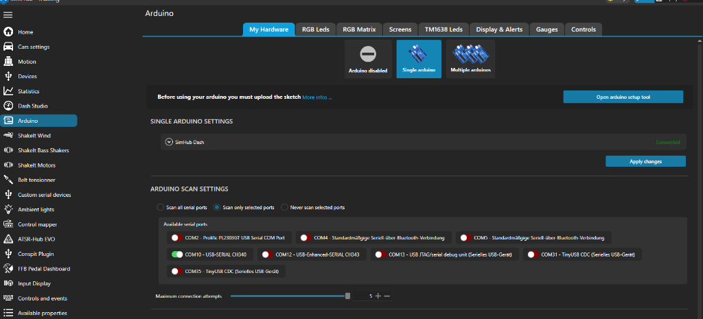
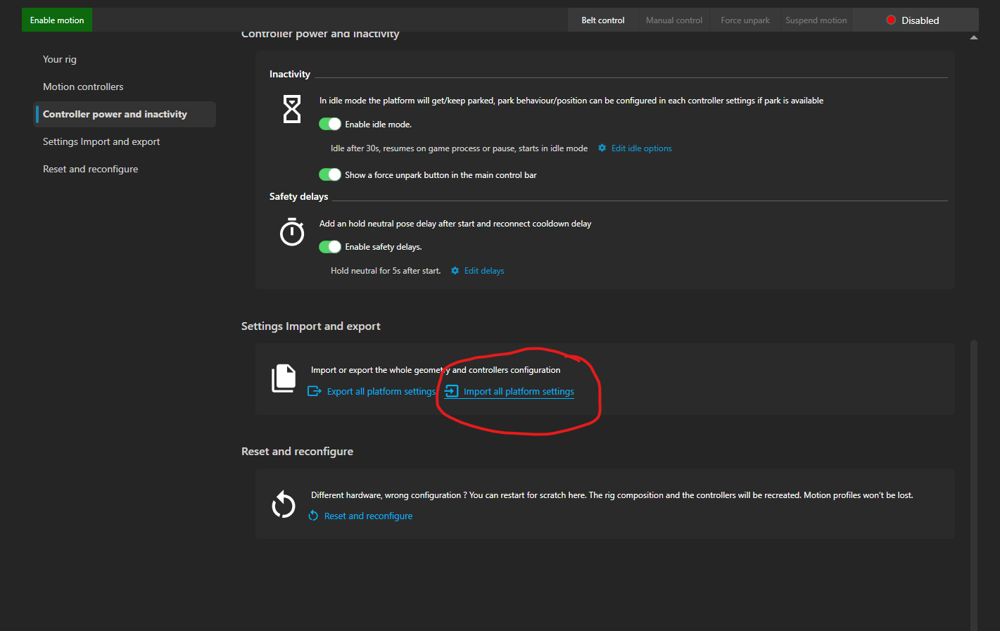
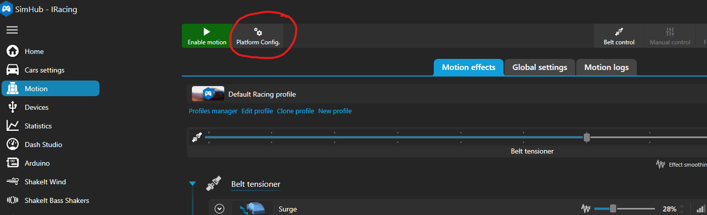
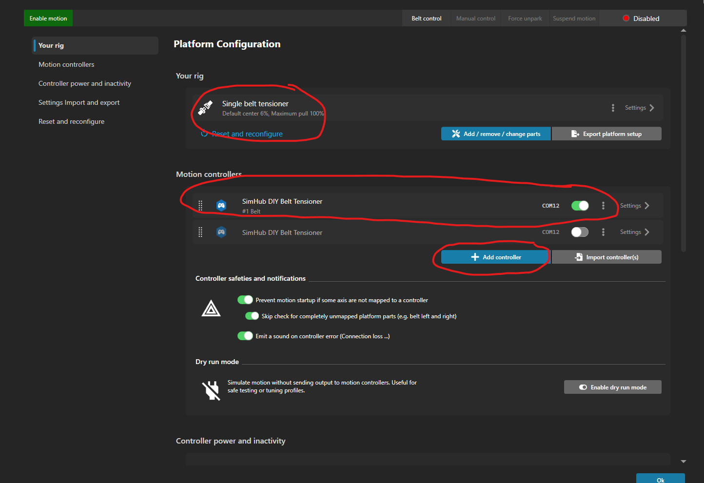
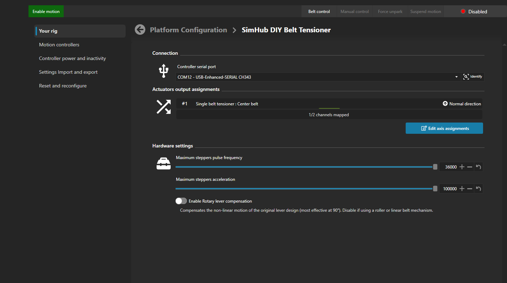

# SimHub Motion Plugin Setup Guide

This guide describes how to configure the official **SimHub Motion Plugin** for the DIY Active FFB Belt Tensioner.

> [!NOTE]
> **SimHub Motion License & Free Trial:**  
> The official SimHub Motion Plugin includes a **20-minute free trial** per session for testing. For uninterrupted sim racing sessions, purchasing the dedicated SimHub Motion license is recommended (one-time purchase of **39€** on [SimHub](https://www.simhubdash.com/diy-belt-tensionner/)).

---

## ⚠️ Preliminary Step: SimHub Arduino Scan Settings

To prevent serial port conflicts and ensure stable communication with the **Motion** plugin, you must configure SimHub's built-in **Arduino** plugin so it does not probe the Belt Tensioner COM port:

1. Open **SimHub** and click on **Arduino** in the left sidebar menu.
2. Select the **My Hardware** tab at the top.
3. Under **ARDUINO SCAN SETTINGS**, choose one of the following methods:
   * **Method A (Recommended):** Select **Scan only selected ports** $\rightarrow$ Make sure your Belt Tensioner COM port (e.g. `COM12`) is **NOT** selected (shown red / disabled).
   * **Method B:** Select **Never scan selected ports** $\rightarrow$ Check/select your Belt Tensioner COM port (e.g. `COM12`) so SimHub never attempts to probe it as an Arduino device.
4. Click the **Apply changes** button.

  

---

## ⚡ Option A: Quick Setup (1-Click Import)

Pre-configured configuration files are provided in the [`docs/motionPluginSetup/`](motionPluginSetup/) folder.

1. Open **SimHub** and navigate to the **Motion** tab on the left.
2. Click **Platform Config.** in the top menu bar.
3. In the left sidebar, click on **Settings Import and export**.
4. Click **Import all platform settings** and select:
   [`docs/motionPluginSetup/AllPlatformSettings.shmotionoutput`](motionPluginSetup/AllPlatformSettings.shmotionoutput)
5. Select your active ESP32 COM port (baud rate: **`250000`**) and click **Enable Motion** $\rightarrow$ The carriage will automatically home against the physical stop, back off into the relaxed park position, and is ready for telemetry!

  

---

## 🛠️ Option B: Manual Step-by-Step Configuration

If you prefer to configure SimHub manually from scratch, follow these steps:

### Step 1: Open Platform Configuration
1. Open **SimHub** and select the **Motion** section on the left sidebar.
2. In the top bar, click the **Platform Config.** button.

  

---

### Step 2: Add Rig Rig Geometry & Motion Controller
1. Under **Your rig**, click **Add / remove / change parts** and choose **Single belt tensioner** (or dual if using 2 actuators).
2. Under **Motion controllers**, click **+ Add controller** and select **SimHub DIY Belt Tensioner**.
3. Enable the controller toggle switch.

  

---

### Step 3: Configure Serial Port, Actuator Mapping & Hardware Limits
Click on **Settings >** next to the **SimHub DIY Belt Tensioner** controller to open its detail page:

1. **Connection:**
   * Select your ESP32 serial port (e.g. `COM12 - CP2102 USB to UART Bridge` or `CH343`) with baud rate set to **`250000`**.
2. **Actuators output assignments:**
   * Map channel `#1` to **Single belt tensioner : Center belt** (Direction: **Normal direction**).
3. **Hardware settings:**
   * **Maximum steppers pulse frequency:** Set to **`36000`** (Maximum slider value).
     > *Note:* The firmware automatically applies a `5.28x` scaling factor to reach the peak pulse capability of **190,000 Hz** (~59.4 rev/s = ~593 mm/s) within the stable hardware limit of `FastAccelStepper`.
   * **Maximum steppers acceleration:** Set to **`100000`** (Maximum slider value).
     > *Note:* The firmware automatically applies a `60.0x` scaling factor to reach **6,000,000 steps/s²** for instantaneous torque and crisp, lag-free response.
   * **Enable Rotary lever compensation:** **OFF / Disabled** (Ensure this is turned off, as our design uses a direct linear rail / spindle mechanism).

  

---

### Step 4: Testing & Enabling Motion
1. Return to the main **Motion** screen in SimHub.
2. Click **Enable motion** in the top left green button.
3. The tensioner will execute its homing sequence against the physical stop, back off into the relaxed park position, and is ready for telemetry!
4. Adjust your desired telemetry motion effects (Surge, Deceleration, Sway, ABS vibration) in the **Motion effects** tab.
