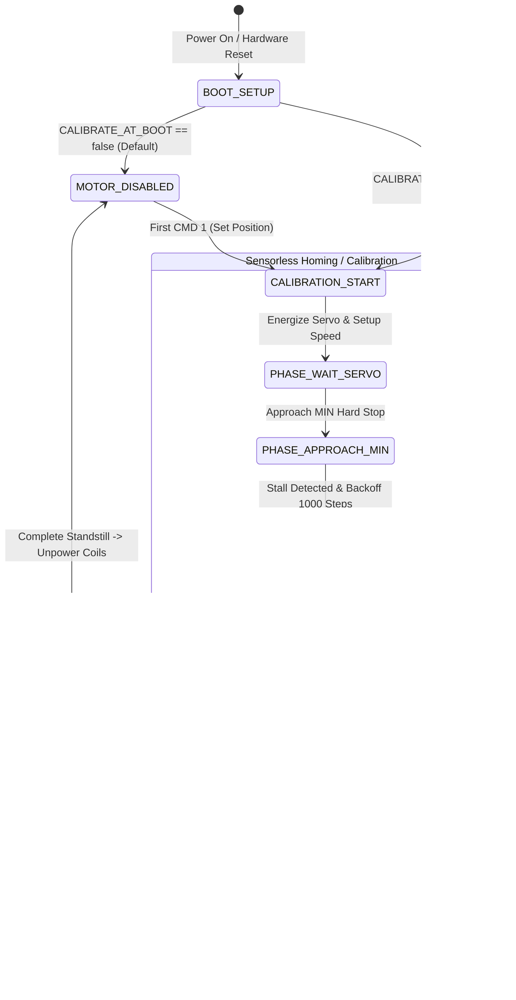

# DIY Belt Tensioner - Architecture & Execution Reference

This reference describes the architecture, internal state machines, and operational lifecycle of the DIY Belt Tensioner firmware (`src/` and legacy `BeltTensionner.ino` / `AxisDriver.h`).

---

## 1. System Overview & Lifecycle



---

## 2. Initialization & Boot Lifecycle (`setup()`)

1. **Serial Interface:** Initializes `Serial` at `250000` Baud.
2. **Greeting:** Broadcasts the number of active actuators:
   ```text
   1 steppers enabled\r\n
   ```
3. **Pulse Generator Engine:** Initializes `FastAccelStepperEngine` hardware timers (ESP32 RMT/MCPWM).
4. **Actuator Pin Configuration (`AxisUnit::begin()`):**
   - Configures Step, Direction, and Modbus UART pins.
   - Initial state: Motor **unpowered** (`motorPowered = false`, `motorReady = false`).
   - Default high-performance motion parameters: Speed up to `180000 Hz`, Acceleration up to `1100000 steps/s²`.

---

## 3. When and How is Homing / Calibration Triggered?

The homing behavior depends on configuration settings and incoming serial commands:

### A. Boot Homing (`CALIBRATE_AT_BOOT = true`)
* The firmware immediately begins the sensorless homing routine upon `setup()`.

### B. Lazy Homing (`CALIBRATE_AT_BOOT = false`) — Recommended
* **At Startup:** The motor remains unpowered and unhomed (`motorPowered = false`, `motorReady = false`). The RGB LED displays **Solid Red**.
* **On First Motion Command:**
  1. SimHub sends the first position packet (`CMD 1`).
  2. `setPosition16Bits()` calls `enableMotor()`.
  3. `enableMotor()` detects `state.homingState == HOMING_IDLE`:
     - Energizes the motor coils and enables the servo via Modbus (`isv57.enableAxis()`).
     - Launches `startSensorlessHoming()`.
     - Returns `false` to block incoming motion commands.
  4. While homing is running, incoming game commands are safely dropped until calibration successfully finishes (`HOMING_DONE`).
  5. The RGB LED turns **Solid Green** and live tracking begins.

### C. Re-Homing After Inactivity Standby
* When the tensioner enters standby after inactivity, motor coils are shut down to prevent heat and power draw.
* Because the shaft has no holding torque while powered off, the firmware resets `homingState = HOMING_IDLE`.
* Upon the next SimHub packet, the tensioner automatically re-homes before applying tension, guaranteeing 100% position accuracy.

### D. Manual Recalibration (`CMD 13` / `HOME`)
* Receiving **CMD 13** or the serial text command **`HOME`** immediately resets calibration and starts the sensorless homing routine.

---

## 4. The Sensorless Homing State Machine (`updateHoming()`)

| State | Phase Name | Execution & Actions | Log Output |
| :--- | :--- | :--- | :--- |
| **`HOMING_START`** | **Start & Config** | • Configures homing speed (`5000 Hz`) and acceleration (`25000 steps/s²`).<br>• Enables servo and pulse generator outputs. | `M1 Starting stepper calibration` |
| **`HOMING_WAIT_SERVO`** | **Servo Comms Sync** | • Waits for valid Modbus telemetry packet from iSV57.<br>• 15-second failsafe timeout if servo power is disconnected. | `M1 Starting calibration` |
| **`HOMING_APPROACH_MIN`** | **MIN Endstop Search** | • Drives carriage backward toward the mechanical stop.<br>• Monitors current load percentage via Modbus register `0x0081`.<br>• Stall detected when current load $\ge$ `HOMING_CURRENT_THRESHOLD_PCT` (15%). | - |
| **`HOMING_BACKOFF_MIN`** | **MIN Zero & Backoff** | • Stops motor instantly (`forceStop()`).<br>• Backs off by `HOMING_BACKOFF_STEPS` (1000 steps) to clear binding.<br>• Sets hardware step coordinate to `0` and zeroes iSV57 optical encoder (`isv57.setZeroPos()`). | `M1 Sensor triggered` |
| **`HOMING_MEASURE_MAX_APPROACH`** | **Stroke Measurement (Optional)** | • *(Only if `MEASURE_MAX_TRAVEL_SENSORLESS = true`)* Drives forward to detect the MAX stop and measure total usable stroke length. | - |
| **`HOMING_RETURN_HOME`** | **Travel to Idle Position** | • Drives to relaxed 10% park position.<br>• Restores high-performance driving speed (`180 kHz`) and acceleration (`1.1M steps/s²`).<br>• Sets `homingState = HOMING_DONE` and `motorReady = true`. | `M1 Calibration successful.` |

---

## 5. Active Control & Driving Mode (`setPosition16Bits()`)

Once `motorReady == true`, the controller processes live position frames:

1. **Position Mapping:**
   $$\text{StepPosition} = \text{constrain}\left(\frac{\text{InputValue} \times \text{totalWorkingRange}}{65535}, 0, \text{totalWorkingRange}\right)$$

2. **Tension Direction Inversion:**
   - **`INVERT_TENSION_DIRECTION = false`:** 0% input (idle) is at MIN stop, 100% input (braking) pulls toward MAX stop.
   - **`INVERT_TENSION_DIRECTION = true`:** 0% input (idle) is at MAX stop, 100% input (braking) pulls toward MIN stop.

3. **Software Safety Margins:**
   Software limits prevent carriage travel outside safe mechanical boundaries (5% to 95% of total travel).

4. **Continuous Step Loss Recovery:**
   While at standstill between movements, the controller continuously cross-checks the ESP32 pulse step counter against the iSV57 internal high-resolution optical encoder and applies zero-drift corrections.

---

## 6. Inactivity Watchdog & Standby (`updateIdleWatchdog()`)

Executed cyclically in `loop()`:

1. **Inactivity Detection:**
   - Evaluates elapsed time since the last valid motion command (`millis() - lastActivityTime > IDLE_DELAY_MS`).
2. **Park Sequence (`moveToIdle`):**
   - Eases the carriage to the relaxed 10% park position using controlled homing speed.
3. **Power-Down (`disableMotor`):**
   - Once standstill is confirmed (`!stepper->isRunning()`):
   - Deactivates pulse outputs (`stepper->disableOutputs()`).
   - De-energizes the servo power stage over Modbus (`isv57.disableAxis()`).
   - Sets `state.motorPowered = false` and resets `state.homingState = HOMING_IDLE`.
   - Log: `M1 Disabling motor`.
   - RGB LED turns **Solid Red**.

---

## 7. Fault & Error Handling (`HOMING_FAILED`)

If a communication timeout or mechanical obstruction occurs:
- The motor is immediately halted (`forceStop()`).
- The servo stage is safely disabled.
- `state.motorReady` remains `false` to block uncalibrated full-speed movements.
- The RGB Status LED flashes **Fast Red** to alert the user.
