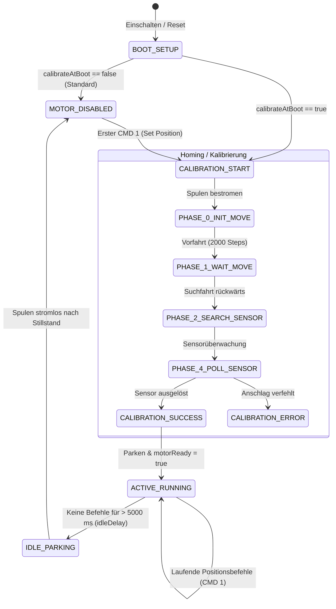

# DIY Belt Tensioner - Ablauf- & Architektur-Referenz (Original-Code)

Diese Referenz beschreibt die genaue Funktionsweise und den Ablauf des Original-Projekts `BeltTensionner` (`BeltTensionner.ino` und `AxisDriver.h`).

---

## 1. Systemübersicht & Lebenszyklus



---

## 2. Detaillierte Phasen & Abläufe

### Phase 1: Initialisierung beim Start (`setup()`)
1. **Serielle Schnittstelle:** Öffnet `Serial` mit `250000` Baud.
2. **Greeting:** Sendet einmalig die Anzahl aktiver Stepper:
   ```text
   1 steppers enabled\r\n
   ```
3. **Schrittmotor-Engine:** Initialisiert `FastAccelStepperEngine`.
4. **Pin-Konfiguration (`AxisDriver::begin()`):**
   - `enablePin` und `directionPin` als `OUTPUT`.
   - `hallSensorPin` als `INPUT` (Analog).
   - Motor wird **stromlos** gestartet (`enablePin = HIGH`).
   - Standardparameter: Speed `25000 Hz`, Accel `15000 Steps/s²`.

---

## 3. Wann und wie wird gehomt / kalibriert?

Das Verhalten hängt von der Konfiguration und den eintreffenden Befehlen ab:

### A. Boot-Homing (`calibrateAtBoot = false` vs `true`)
* **Standard (`calibrateAtBoot = false`):**
  - Beim Booten findet **keine** Bewegung statt.
  - Der Motor bleibt stromlos und unkalibriert (`motorPowered = false`, `motorReady = false`).
* **Optional (`calibrateAtBoot = true`):**
  - Die Firmware startet sofort bei `setup()` die Homing-Sequenz.

### B. Lazy Homing (Kalibrierung beim ersten Fahrbefehl)
Wenn `calibrateAtBoot == false` eingestellt ist:
1. SimHub sendet den ersten Positionsbefehl **CMD 1**.
2. `setPosition16Bits()` ruft intern `EnableMotor()` auf.
3. `EnableMotor()` erkennt, dass der Motor noch nicht bestromt ist:
   - Schaltet `enablePin` auf `LOW` (Spulen aktiv).
   - Gibt `M1 Enabling motor` aus.
   - Setzt `calibrationPhase = 0` und `motorReady = false`.
4. Die Homing-Sequenz startet automatisch. Eingehende Fahrbefehle werden während der Kalibrierung gepuffert bzw. zurückgestellt, bis `motorReady == true` ist.

### C. Manuelle Rekalibrierung (CMD 13 / Discard Calibration)
* Empfängt der Controller **CMD 13** (`0xFF 0xFF 0x0D 0x0A 0x0D`):
  - Setzt `calibrationPhase = 0` und `motorReady = false`.
  - Beim nächsten Zyklus wird die Homing-Routine erneut von Phase 0 bis 4 durchlaufen.

---

## 4. Die 5 Kalibrierungsphasen (`Calibrate()`)

| Phase | Interne Bezeichnung | Ablauf & Aktionen | Log-Ausgabe |
| :--- | :--- | :--- | :--- |
| **0** | **Start & Freifahrt** | • Setzt Homing-Speed auf `5000 Hz`, Accel auf `20000`.<br>• Setzt Position temporär auf `0`.<br>• Fährt `+2000 Steps` vorwärts (weg vom Sensor). | `M1 Starting stepper calibration` |
| **1** | **Warten auf Freifahrt** | • Wartet, bis die +2000 Steps Vorfahrt abgeschlossen ist (`!stepper->isRunning()`). | `M1 Initial move finished` |
| **2** | **Suchfahrt rückwärts** | • Startet Suchfahrt rückwärts: `stepper->moveTo(-totalWorkingRange * 3)`.<br>• Liest Sensor einmalig zur Rauschunterdrückung. | `M1 Starting calibration` |
| **3** | **Plausibilitätsprüfung** | • Prüft, ob der Sensor bereits ausgelöst ist.<br>• Wenn JA: Fataler Fehlerabbruch (`calibrationErrorDeath`). | *(Fehlertext bei Hardwaredefekt)* |
| **4** | **Trigger-Erkennung** | • Liest zyklisch den Hall-Sensor (`ReadHallSensor()`).<br>• **Sensor löst aus (`val > 100`):**<br>&nbsp;&nbsp;1. `stepper->forceStopAndNewPosition(ZeroOffset)` (ZeroOffset = 1500).<br>&nbsp;&nbsp;2. Fährt auf Leerlaufposition (`MoveToIdle(false)`).<br>&nbsp;&nbsp;3. Beendet Kalibrierung (`calibrationPhase = -1`, `motorReady = true`).<br>• **Motor stoppt ohne Trigger:** Fataler Fehlerabbruch. | `M1 Sensor triggered`<br>`M1 Calibration successful.` |

---

## 5. Regelungs- & Fahrbetrieb (`setPosition16Bits()`)

Sobald `motorReady == true` ist, verarbeitet der Controller Fahrbefehle:

1. **Positions-Mapping:**
   $$\text{StepPosition} = \text{constrain}\left(\frac{\text{InputValue} \times \text{totalWorkingRange}}{65535}, 0, \text{totalWorkingRange}\right) + \text{ZeroOffset}$$
   *(wobei `ZeroOffset = 1500` als Sicherheitsabstand zum Sensor dient)*

2. **6-Sekunden Soft-Start-Rampe:**
   - Nach jedem Aufwecken aus dem Ruhezustand (`firstActivity == 0`) startet ein 6000 ms Timer.
   - Geschwindigkeit und Beschleunigung werden über die ersten 6 Sekunden linear von 0% auf 100% hochgerampt:
     $$\text{Faktor} = \text{constrain}\left(\frac{\text{Zeit} - \text{firstActivity}}{6000}, 0.0, 1.0\right)$$
   - Verhindert ruckartiges Anreißen beim Einstieg ins Spiel.

---

## 6. Inaktivitäts-Watchdog & Parken (`update()`)

Wird in der Hauptschleife `loop()` zyklisch aufgerufen:

1. **Inaktivitätsprüfung:**
   - Wenn seit dem letzten empfangenen Befehl mehr als `idleDelay = 5000 ms` vergangen sind:
2. **Parkfahrt (`MoveToIdle`):**
   - Schaltet auf gedrosselte Park-Geschwindigkeit (`4000 Hz`, Accel `2000`).
   - Fährt auf `ZeroOffset` (oder 50%-Zentralstellung, falls `centerAfterCalibration == true`).
3. **Abschaltung:**
   - Sobald der Schlitten stillsteht (`!stepper->isRunning()`):
   - Ruft `DisableMotor()` auf $\rightarrow$ Spulen werden stromlos (`enablePin = HIGH`).
   - Log: `M1 Disabling motor`.

---

## 7. Fehlerbehandlung (`calibrationErrorDeath`)

Tritt während der Kalibrierung ein mechanischer oder sensorischer Fehler auf:
- Der Motor wird sofort stromlos geschaltet (`DisableMotor()`).
- Es wird eine Fehlermeldung ausgegeben (z. B. `M1 Calibration ERROR, lever not found...`).
- Das System geht in eine Endlosschleife und blockiert weitere Fahrten, bis das Gerät neu gestartet wird.
